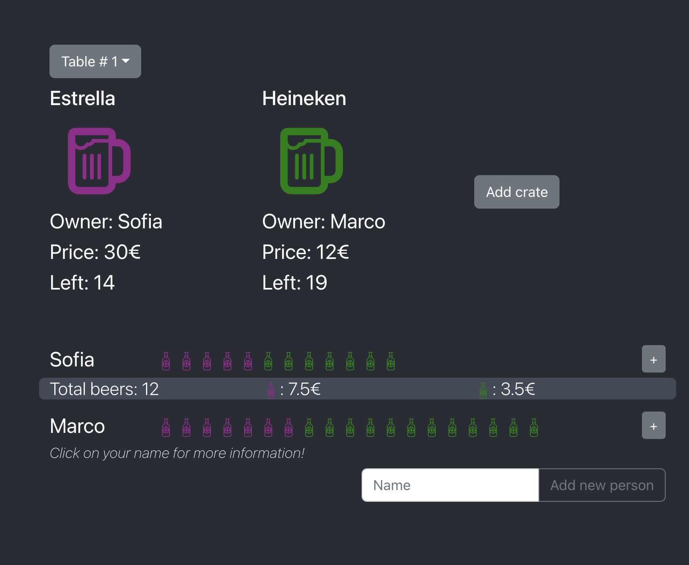

# BeerCounter
App that counts amount of crates bought and beers consumed by each person

Use `"npm run server"` to start up the server (port 8000), and use `"npm run client"` to start  React frontend (port 3000)

:warning: **Unfinished Code**

